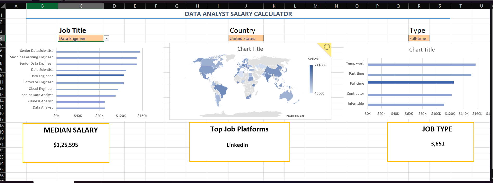

## 📊 Data Analyst Salary Dashboard Preview

This interactive Excel dashboard helps users explore global salary trends across job roles, countries, and job types in data and software-related fields.

### 🔍 Key Features

- 🎯 **Interactive Filters** — Easily switch between job titles, countries, and employment types.
- 📈 **Dynamic Charts** — Visualize median salaries based on filters.
- 🌍 **Global Heatmap** — See salary distribution around the world.
- 📌 **Platform Insights** — Discover top job posting platforms.
- 🧮 **Summary Metrics** — Quickly see median salary & job counts.

> 🔗 [Download Project File (.xlsx)](https://github.com/Harshvspr/Data-analyst-project-1/blob/main/3_Collaboration%20final.xlsx)

---

**Tools Used**: Excel, Power Query, Pivot Tables, Charts  
**Goal**: Improve data analysis, visualization & Excel dashboard skills  
**Next Step**: Add experience-level filter, import live job data, and build a web version.

